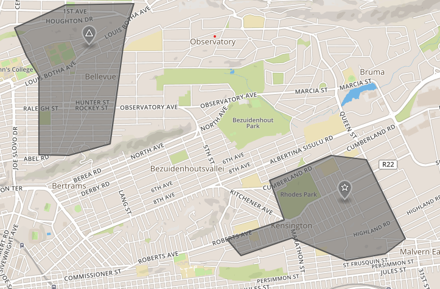

# Realtime Large Scale Geofencing with Spark Streaming

We created this to help some of our customers in the Fleet Tracking business who have in the order of million vehicles. Goal is showcase possibility in in terms of performance for production usage.

### Considerations
* Minimal dependencies: The existing geo spatial libraries for spark seem out of date - so we made conscious effort to use minimum dependencies as possible (`shapely` is the only real one).
* We used `Azure Databricks` here - however you may use `open source Spark` as well.
* Streaming source & sink: We used `Azure Eventhubs` - you may use `kafka` or any other sources/sinks
* We are using `Geojson` format for both points and polygons as a best practice 

### High level concepts for our solution

__Data__

We need the following data for our solution:
* Points data (locations/latlong) of various entities(vehicles) from a streaming source (e.g. Kafka/Azure event hub)
* Polygon data (maps) representing the Geofences (this generally does not change often)
* Relation/mapping between the points & polygons (e.g. vehicle A may be associated with Geofence X)

__Logic__
* Read the incoming streaming data (Points data in geojson format from a Streaming source) 
* We do a join of Points data with the Geofence data (Polygons). E.g vehicle A may be associated with Geofence X
* We apply geofence logic on the joined dataframe to check if the Point is within the Polygon - and add this new Geofence column (boolean) to the joint dataframe
* We send the result to the Sink (Eventhub/Kafka)

If the above is unclear check the `Basics of Geofencing` section - code is often more explanatory.

### Explore our solution
 

1. [Setup](1.%20Setup)

2. [Basics of Geofencing with Spark Streaming](2.%20Basics%20of%20Geofencing%20with%20Spark%20Streaming)

3. [Large Scale Geofencing with Spark Streaming](3.%20Large%20Scale%20Geofencing%20with%20Spark%20Streaming)

###Performance Benchmark Summary: 
* Roughly we were able to run geofencing for 3.7 million Geojson messages in 2 mins 10 sec (throughput of 28k/sec). 
* The cluster size was 32 cores (4 cores * 8 nodes). 
* Data was for 1000 vehicles (and one geofence for each).

Test data generator can be customized to generate data according to your scale.